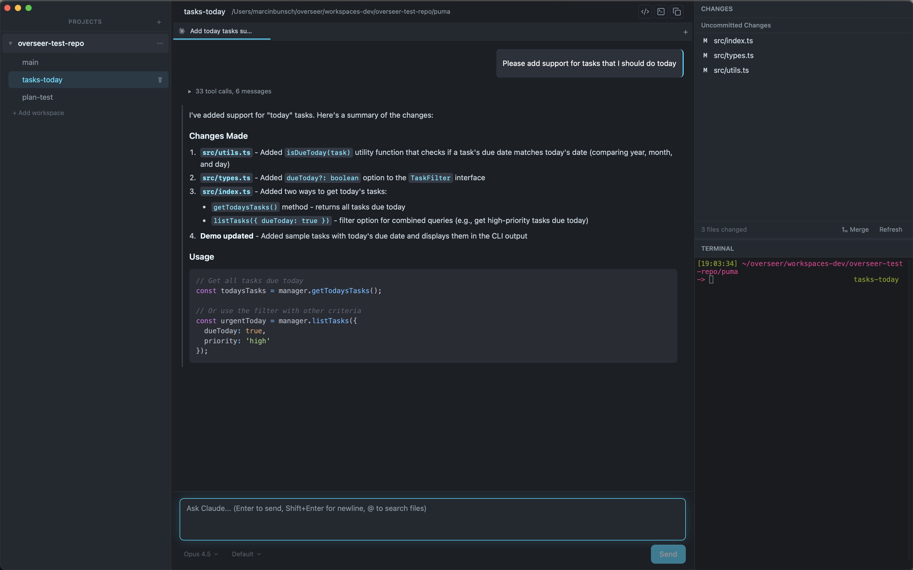
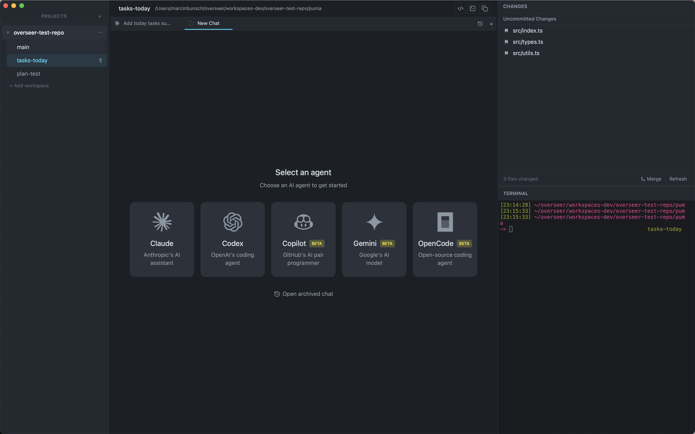
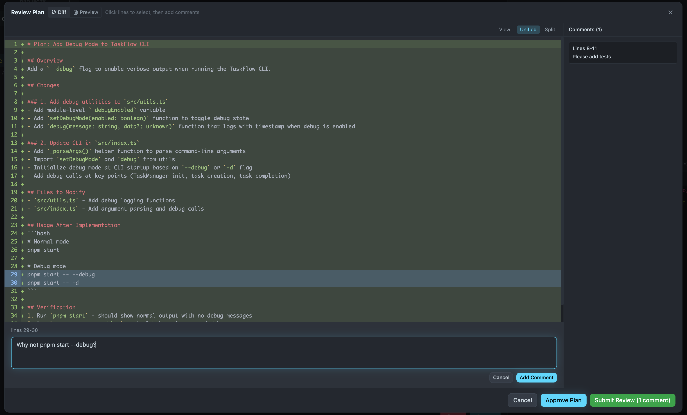
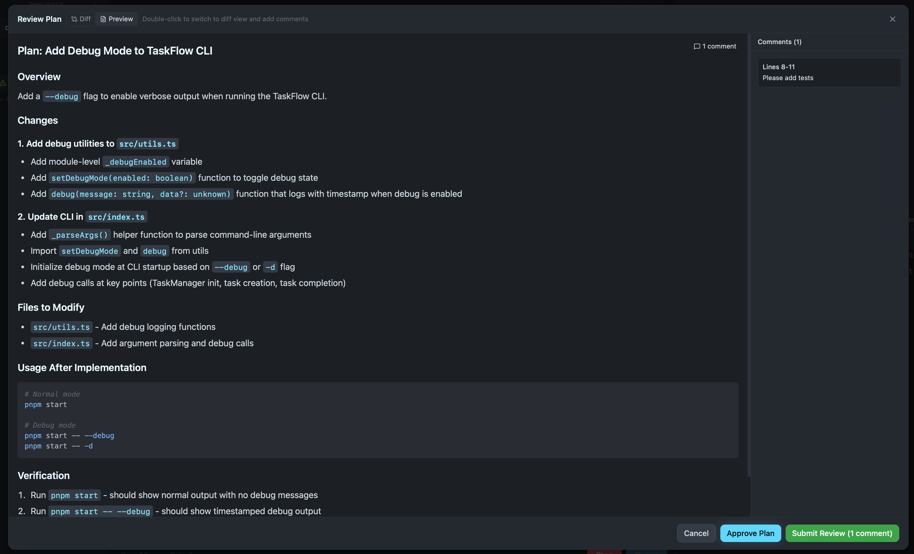
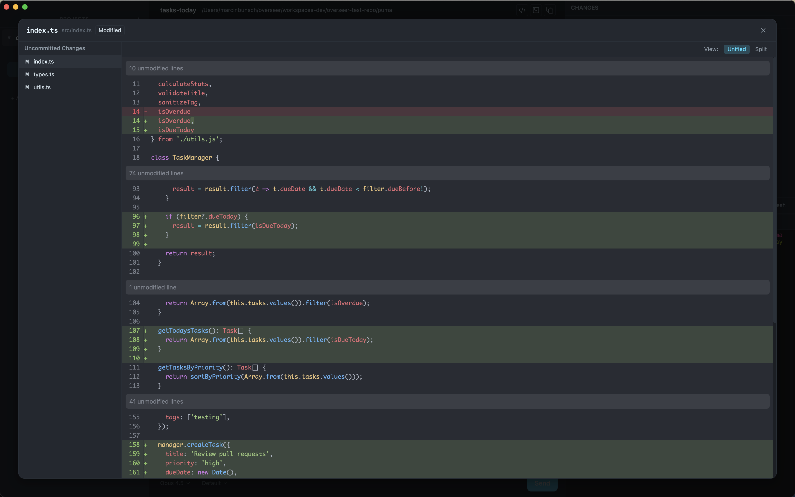

<p align="center">
  <a href="https://github.com/marcinbunsch/overseer">
    
  </a>
</p>

<h1 align="center">Overseer</h1>

<p align="center">
  Oversee your AI coding agents.<br/>
  Manage repositories, run multiple agents side-by-side, review diffs, and stay in control — all in one window.
</p>

<p align="center">
  Built with Tauri v2, React 19, and TypeScript.
</p>

> **Alpha Release** — This is early software. Expect bugs, missing features, and breaking changes. macOS only for now.

## Design Principles

I built Overseer for myself — to learn how these apps work and to build something tailored to how I use AI coding agents. You might not like it, and that's okay. It's open-source and MIT licensed — do whatever you want with it.

I was inspired by:

- [Conductor](https://www.conductor.build) - heavily inspired by Conductor's design and features, but I wanted to build something open-source and more lightweight for my personal use
- [Commander](https://commanderai.app/)
- [CodexMonitor](https://www.codexmonitor.app/)

These are all great apps — probably better than this one, you should check them out!

My main design principles are:

**Open-source** — Fully open. Take it, fork it, build on top of it, steal ideas from it.

**Private** — No telemetry, no API keys. Overseer talks to CLI tools you install and control locally. Your code and conversations stay on your machine.

**Performant** — No idle polling - everything is event-driven and reactive. The goal is minimal resource usage while providing a pleasurable experience. The app should do _nothing_ when idle.

**Extensible** — Want to add another agent? The agent abstraction is designed for it. Each agent backend implements a simple service interface, and the registry handles the rest.

**Review & Feedback Focused** — I want to stay in control of my agents, so reviewing their changes and giving feedback is a first-class experience. Inline diffs, line commenting, plan review mode, and more.

## Screenshots

<table>
  <tr>
    <td align="center" width="50%">
      
      <br /><em>Chat View</em>
    </td>
    <td align="center" width="50%">
      
      <br /><em>New Chat View</em>
    </td>
  </tr>
  <tr>
    <td align="center">
      
      <br /><em>Plan Review — Diff View</em>
    </td>
    <td align="center">
      
      <br /><em>Plan Review — Markdown View</em>
    </td>
  </tr>
  <tr>
    <td align="center" colspan="2">
      
      <br /><em>Changes Diff View</em>
    </td>
  </tr>
</table>

## Supported Agents

- **Claude Code** — I use it the most, so it has the most features and polish. Full support for tools, questions, and overseer actions.
- **Codex** — decent support - if this is your main agent, CodexMonitor is probably a better choice, but I use Codex occasionally and wanted to support it here as well.
- (experimental) **GitHub Copilot**
- (experimental) **Gemini CLI**
- (experimental) **OpenCode**

Each agent can be enabled/disabled independently, and you can set a default agent for new chats.

## Features

**Workspace Management**

- Add repositories, create git worktrees (auto-named), archive/delete with confirmation
- Expand/collapse repos in a sidebar tree view
- Configurable init prompts per workspace
- Also supports adding a folder - but workspaces are not supported then.

**Chat Interface**

- Multiple concurrent conversation tabs per workspace
- Streaming markdown with syntax-highlighted code blocks
- `@` file search autocomplete — type `@` to fuzzy-match and insert file paths
- Model selection per chat (from available models per agent)
- Chat history

**Review & Feedback**

- Inline diff dialogs for every Edit/Write tool call — review changes before they land
- Line selection and commenting on diffs — click or drag line numbers, add feedback, send it back to the agent
- Plan review mode — review agent plans with markdown/code view switching and line-by-line commenting
- Changed files pane with full git diff against base branch
- Collect comments across multiple files into a single review before sending

**Agent Interaction**

- Tool approval for commands and file changes
- Agent questions UI (single and multi-select)
- Overseer Actions — agents can trigger actions (rename chat, open PR, merge branch) via protocol

**Terminal & Git**

- Integrated xterm.js terminal scoped to the workspace directory
- PR status display and creation via `gh` CLI
- Branch operations: rename, delete, merge

## Getting Started

**Prerequisites**: Rust, Node.js, pnpm

```bash
# Install dependencies
pnpm install

# Run in development mode (frontend + Rust backend with hot reload)
pnpm dev

# Or frontend-only dev server (no Tauri shell)
pnpm vite-dev
```

## Development

```bash
pnpm dev          # Full Tauri dev mode
pnpm build        # Production build
pnpm test         # Run tests
pnpm checks       # All checks: format + lint + typecheck + rustcheck
pnpm checks:ui    # UI-only checks: format + lint + typecheck
pnpm lint         # ESLint
pnpm format       # Prettier (write)
```

Always run `pnpm checks` (or `pnpm checks:ui` for UI-only changes) before committing.

## Documentation

- **[docs/OVERSEER.md](docs/OVERSEER.md)** — Full architecture, source structure, data models, and feature reference
- **[docs/features/](docs/features/)** — Implemented feature specs
- **[docs/plans/](docs/plans/)** — Planned feature specs
- **[docs/agents/](docs/agents/)** — Agent-specific implementation details and docs

## License

[MIT](LICENSE)
